# CNN Accelerator - Hardware Implementation For FPGA

[](https://www.xilinx.com)
[]()
[]()

## 📋 Overview

A **hardware-accelerated Convolutional Neural Network (CNN)** accelerator designed in Verilog for FPGA deployment. This project implements a complete inference pipeline optimized for edge computing applications, featuring a serial MAC architecture, streaming input buffer, and integrated max pooling. The design achieves **721 FPS throughput** on MNIST-like datasets while consuming only **165mW total power**.

**Target Application:** Real-time image classification (28×28 grayscale images)  
**Compute Strategy:** Time-multiplexed serial convolution with hardware-managed memory  
**Key Innovation:** Flow-controlled streaming architecture with double-line-buffer windowing

---

## ✨ Key Features

| Feature          | Implementation                                              |
| ---------------- | ----------------------------------------------------------- |
| **Architecture** | Streaming serial CNN accelerator with FSM-based control     |
| **Convolution**  | 3×3 kernel, 8 filters, serial MAC (9 cycles/window)         |
| **Activation**   | Hardware ReLU (single-cycle)                                |
| **Pooling**      | 2×2 Max Pooling with FSM-controlled memory reads            |
| **Memory**       | On-chip BRAM (8×RAMB36) for feature maps                    |
| **Input Buffer** | Sliding window with double-line-buffer (supports streaming) |
| **Data Width**   | 8-bit signed integer                                        |
| **Precision**    | Bit-accurate inference verified against Python golden model |

---

## 🏗️ Architecture Overview

<!--
### System Block Diagram

```
┌─────────────────────────────────────────────────────────────────────┐
│                          CNN ACCELERATOR TOP                         │
├─────────────────────────────────────────────────────────────────────┤
│                                                                      │
│  ┌──────────────┐     ┌─────────────────────────────────────┐      │
│  │ MAIN FSM     │────▶│        DATAPATH PIPELINE            │      │
│  │ Controller   │     │                                     │      │
│  │              │     │  ┌────────────┐    ┌─────────────┐  │      │
│  │ • 10 States  │     │  │  Sliding   │───▶│ 3×3 Serial  │ │      │
│  │ • Control    │     │  │  Window    │    │ Convolution │ │      │
│  │   Signals    │     │  │  Buffer    │    │   (MAC)     │ │      │
│  └──────────────┘     │  └────────────┘    └─────────────┘ │      │
│         │             │         │                  │        │      │
│         │             │         └─────────┬────────┘        │      │
│         ▼             │                   ▼                 │      │
│  ┌──────────────┐     │           ┌─────────────┐          │      │
│  │  Address     │     │           │    ReLU     │          │      │
│  │  Generator   │     │           └─────────────┘          │      │
│  │              │     │                   │                 │      │
│  │ • Filter Cnt │     │                   ▼                 │      │
│  │ • Window Cnt │     │           ┌─────────────┐          │      │
│  └──────────────┘     │           │ Feature Map │          │      │
│                       │           │    BRAM     │          │      │
│  ┌──────────────┐     │           │  (5408×32)  │          │      │
│  │   Weight     │     │           └─────────────┘          │      │
│  │     ROM      │     │                   │                 │      │
│  │ (8 filters)  │     │                   ▼                 │      │
│  └──────────────┘     │           ┌─────────────┐           │      │
│                       │           │ Max Pooling │           │      │
│                       │           │     Unit    │           │      │
│                       │           └─────────────┘           │      │
│                       └─────────────────────────────────────┘      │
│                                                                     │
│  Input: pixel_data[7:0] + axis_ready (flow control)                │
│  Output: result[31:0] + output_valid + done                        │
└─────────────────────────────────────────────────────────────────────┘
``` -->

### System Block Diagram


---

## 🔄 FSM Architecture

### Main Controller FSM

The primary control unit orchestrates the entire inference pipeline through 10 carefully designed states.


**State Descriptions:**

| State          | Function                                       |
| :------------- | :--------------------------------------------- |
| `IDLE`         | Wait for start signal, reset counters          |
| `STREAM_ALL`   | Stream 28×28 pixels into sliding window buffer |
| `SHIFT_NEXT`   | Transition state after window increment        |
| `SETUP_CONV`   | Prepare convolution inputs                     |
| `PROCESS_CONV` | Issue conv_start pulse                         |
| `CONV_WAIT`    | Wait for MAC to compute 3×3 convolution        |
| `STORE_RESULT` | Write ReLU output to BRAM                      |
| `CHECK_LOOP`   | Loop control logic (filter/window advancement) |
| `WAIT_POOL`    | Initiate pooling operation                     |
| `POOLING_ACT`  | Execute 2×2 max pooling on all feature maps    |

### Serial Convolution FSM

The convolution module implements a resource-efficient serial MAC that processes one multiply-accumulate per cycle.

```mermaid
stateDiagram-v2
    [*] --> IDLE

    IDLE --> CLEAR : start=1
    IDLE --> IDLE : start=0

    CLEAR --> LOAD : clear=1

    LOAD --> BUSY : compute=1 (idx=0)

    BUSY --> BUSY : idx < 8 / compute=1, idx++
    BUSY --> DONE : idx == 8

    DONE --> IDLE : done=1, result=acc / clear=1

    note right of CLEAR
        Clears accumulator
        Prepares for new window
    end note

    note right of LOAD
        First MAC operation
        a0×w0 → acc
    end note

    note right of BUSY
        Serial MAC iterations
        a[idx]×w[idx] + acc
        idx: 1 → 8
    end note

    note right of DONE
        Latch final result
        Assert done signal
    end note
```



**Convolution Timing:**

- **Latency:** 11 cycles (1 CLEAR + 1 LOAD + 8 BUSY + 1 DONE)
- **Throughput:** 1 convolution every 11 cycles
- **Operations:** 9 multiplies + 8 additions = 17 ops/convolution

---

## 📦 Module Hierarchy

### Top-Level Modules

#### 1. **cnn_TOP**

Top-level integration module connecting all sub-systems.

**Parameters:**

```verilog
IMG_WIDTH    = 28    // Input image width
IMG_HEIGHT   = 28    // Input image height
DATA_WIDTH   = 8     // Pixel/weight bit-width
ACC_WIDTH    = 32    // Accumulator bit-width
NUM_FILTERS  = 8     // Number of convolutional filters
```

**Interfaces:**

- **Control:** `clk`, `rst_n`, `start`, `done`
- **Input:** `pixel_data[7:0]`, `axis_ready` (backpressure)
- **Output:** `result[31:0]`, `output_valid`

---

#### 2. **cnn_controller**

10-state FSM managing the inference pipeline.

**Key Signals:**
| Signal | Direction | Description |
|--------|-----------|-------------|
| `win_valid` | Input | Sliding window has valid 3×3 data |
| `conv_done` | Input | Convolution completed |
| `last_filter` | Input | Processing last filter (filter #7) |
| `done_all_windows` | Input | All 676 windows processed |
| `pool_done` | Input | Pooling completed |
| `addr_clear` | Output | Reset address generator |
| `conv_start` | Output | Start convolution |
| `ram_we` | Output | Write enable for feature map BRAM |
| `inc_filter` | Output | Increment filter counter |
| `inc_window` | Output | Advance to next window |
| `pool_start` | Output | Start pooling operation |
| `is_streaming` | Output | Currently in STREAM_ALL state |
| `is_shifting` | Output | Currently in SHIFT_NEXT state |

**Control Logic:**

- **Nested Loops:** For each window (676) → For each filter (8) → Convolve
- **Backpressure:** Managed via `axis_ready = is_streaming || is_shifting`
- **Sequential Execution:** No pipeline overlapping (simplifies control)

---

#### 3. **sliding_window_3x3**

Implements a line-buffer-based sliding window for 3×3 neighborhood extraction.

**Architecture:**

```
Input Stream → [Line Buffer 0 (28 pixels)] ─┐
               [Line Buffer 1 (28 pixels)] ─┼─→ 3×3 Window Register → Outputs w0..w8
               [Current Pixel]             ─┘
```

**Features:**

- **Storage:** 2×28 = 56 registers for line buffers
- **Output:** Provides 9 simultaneous pixel values (w0-w8 in row-major order)
- **Valid Signal:** Asserted when window is valid (after row≥2, col≥2)

**Timing:**

- **Warm-up:** First valid window appears after 28×2 + 3 = 59 pixels
- **Throughput:** 1 valid window per pixel (after warm-up)

---

#### 4. **conv3x3_serial**

Serial multiply-accumulate (MAC) unit for 3×3 convolution.

**Datapath:**

<!-- ```
Input Mux                MAC Core                Result Latch
┌─────────┐             ┌──────────┐             ┌──────────┐
│ a[0..8] │───[idx]────▶│ a × b    │───+───────▶│   acc    │
│ w[0..8] │───[idx]────▶│          │   │         └──────────┘
└─────────┘             └──────────┘   │               │
                             ▲          │               │
                             └──────────┘───[accumulate]
``` -->


<!-- **Performance:**

- **Resource:** 1 multiplier (inferred DSP or LUT-based)
- **Latency:** 11 cycles per 3×3 window
- **Data Width:** 8×8 multiply → 32-bit accumulator -->

**Index Mapping:**

```
Window Layout:      MAC Order:
┌───┬───┬───┐      a0×w0 → acc
│ 0 │ 1 │ 2 │      a1×w1 + acc
├───┼───┼───┤      a2×w2 + acc
│ 3 │ 4 │ 5 │      ...
├───┼───┼───┤      a8×w8 + acc
│ 6 │ 7 │ 8 │
└───┴───┴───┘
```

---

#### 5. **address_generator**

Generates write addresses for storing convolution results in BRAM.

**Address Calculation:**

```
write_addr = (filter_cnt × 676) + (fmap_row × 26) + fmap_col

Where:
  filter_cnt ∈ [0, 7]     // Current filter being processed
  fmap_row   ∈ [0, 25]    // Feature map row (28-2 = 26)
  fmap_col   ∈ [0, 25]    // Feature map col (28-2 = 26)
```

**Memory Layout:**

```
BRAM Address Map (5408 locations):
[0000 - 0675]: Filter 0 output (26×26 = 676)
[0676 - 1351]: Filter 1 output
[1352 - 2027]: Filter 2 output
...
[4732 - 5407]: Filter 7 output
```

**Status Signals:**

- `last_filter`: Asserted when processing filter #7
- `done_all`: Asserted when processing the last window (window #675)

**Optimization Note:**
Address calculation uses registered output (`write_addr`) to break the critical path from counters → multipliers → BRAM address input, improving timing closure.

---

#### 6. **max_pooling_unit**

Performs 2×2 max pooling on the 26×26 feature maps, producing 13×13 outputs per filter.

**Algorithm:**

```
For each filter (0-7):
    For each pool_row (0-12):
        For each pool_col (0-12):
            Read 4 values:
                val0 = BRAM[2*pool_row,   2*pool_col  ]
                val1 = BRAM[2*pool_row,   2*pool_col+1]
                val2 = BRAM[2*pool_row+1, 2*pool_col  ]
                val3 = BRAM[2*pool_row+1, 2*pool_col+1]
            Output max(val0, val1, val2, val3)
```

**FSM States:**

- **FETCH_INIT:** Issue first BRAM read
- **WAIT_0 / FETCH_1:** Pipeline stage for val0
- **WAIT_1 / FETCH_2:** Pipeline stage for val1
- **WAIT_2 / FETCH_3:** Pipeline stage for val2
- **WAIT_3 / COMPARE:** Read val3, compute max, output result

<!-- **Latency:**

- **Per Pool Window:** 8 cycles (fetch pipeline + compare)
- **Total:** 8 filters × 13×13 windows × 8 cycles = **10,816 cycles** -->

**Output:**

- **Rate:** 1 pooled value every 8 cycles
- **Valid Signal:** `valid_out` pulses when `data_out` contains valid result

---

#### 7. **relu**

Combinational ReLU activation function.

**Logic:**

```verilog
assign dout = (din[31] == 1'b1) ? 32'd0 : din;  // If negative, output 0
```

**Characteristics:**

- **Latency:** 0 cycles (pure combinational)
- **Resource:** 1 comparator + 1 mux (minimal LUTs)

---

#### 8. **mac_simple**

Basic multiply-accumulate unit used by the convolution module.

**Operation:**

```verilog
if (clear)
    acc <= 0;
else if (compute)
    acc <= acc + (a × b);
```

**Timing:**

- **Clear:** 1 cycle
- **Compute:** 1 cycle per operation
- **Width:** 8-bit inputs → 32-bit accumulator

---

#### 9. **weight_rom_2**

Stores the 8 trained convolutional kernels.

**Storage Format:**

```
Filter 0: [w0 w1 w2 w3 w4 w5 w6 w7 w8] = 72 bits
Filter 1: [w0 w1 w2 w3 w4 w5 w6 w7 w8] = 72 bits
...
Filter 7: [w0 w1 w2 w3 w4 w5 w6 w7 w8] = 72 bits

Total: 8 filters × 72 bits = 576 bits
```

**Access:**

- **Address:** `filter_cnt[2:0]` (0-7)
- **Output:** `data_out[71:0]` (9 weights × 8 bits, flat)
- **Latency:** 1 cycle (registered ROM)

---

#### 10. **simple_ram**

Infers 8×RAMB36 blocks for feature map storage.

**Configuration:**

- **Depth:** 5408 locations (8 filters × 26×26)
- **Width:** 32 bits (signed integer)
- **Type:** Single-port synchronous RAM
- **Write:** When `ram_we=1`
- **Read:** Registered output (1-cycle latency)

---

## ⚡ Performance Analysis

### Synthesis Results

**Target Device:** Xilinx Artix-7 XC7A200T-1 (Speed Grade -1)  
**Tool Version:** Vivado 2025.1

#### Resource Utilization

| Resource           | Used | Available | Utilization | Notes                        |
| ------------------ | ---- | --------- | ----------- | ---------------------------- |
| **Slice LUTs**     | 651  | 134,600   | **0.48%**   | Very low logic usage         |
| **Registers (FF)** | 884  | 269,200   | **0.33%**   | Dominated by line buffers    |
| **RAMB36**         | 8    | 365       | **2.19%**   | Feature map storage          |
| **RAMB18**         | 0    | 730       | 0%          | Not used                     |
| **DSP48E1**        | 0    | 740       | **0%**      | Multipliers inferred as LUTs |
| **CARRY4**         | 77   | 33,650    | 0.23%       | Address arithmetic           |
| **BUFG**           | 1    | 32        | 3.13%       | Global clock                 |

#### Hierarchical Utilization

| Module               | LUTs    | FFs     | RAMB36 | Function            |
| -------------------- | ------- | ------- | ------ | ------------------- |
| `sliding_window_3x3` | 204     | 543     | 0      | Input buffering     |
| `max_pooling_unit`   | 178     | 155     | 0      | 2×2 max pooling FSM |
| `conv3x3_serial`     | 120     | 74      | 0      | Serial MAC + FSM    |
| `address_generator`  | 75      | 36      | 0      | Memory addressing   |
| `weight_rom_2`       | 19      | 60      | 0      | Kernel weights      |
| `simple_ram`         | 0       | 0       | 8      | Feature maps        |
| **Total**            | **651** | **884** | **8**  |                     |

---

### Timing Performance

**Clock Constraint:** 12.5ns (80 MHz)

| Metric                         | Value        | Status            |
| ------------------------------ | ------------ | ----------------- |
| **Worst Negative Slack (WNS)** | **+1.886ns** | ✅ **MET**        |
| **Total Negative Slack (TNS)** | 0.000ns      | ✅ **MET**        |
| **Worst Hold Slack (WHS)**     | +0.144ns     | ✅ **MET**        |
| **Total Hold Slack (THS)**     | 0.000ns      | ✅ **MET**        |
| **Worst Pulse Width Slack**    | +5.750ns     | ✅ **MET**        |
| **Failing Endpoints**          | 0            | ✅ **PASS**       |
| **Achieved Frequency**         | **80 MHz**   | ✅ **TARGET MET** |

**Critical Path Analysis:**

- **Setup Critical Path:** 10.614ns (Source: `addr_gen/filter_cnt_reg[1]` → Dest: `conv_mod/mac_u/acc_reg[16]`)
- **Slack Margin:** +15.1% above target period
- **Bottleneck:** Address generation arithmetic (multiply + add) feeding into MAC accumulator

---

### Power Consumption

**Analysis Method:** Post-route power estimation

| Power Domain      | Dynamic (W) | Static (W) | Total (W) | Percentage |
| ----------------- | ----------- | ---------- | --------- | ---------- |
| **Clocks**        | 0.002       | —          | 0.002     | 7%         |
| **Slice Logic**   | 0.002       | —          | 0.002     | 5%         |
| **Signals**       | 0.003       | —          | 0.003     | 10%        |
| **Block RAM**     | 0.015       | —          | 0.015     | 46%        |
| **I/O**           | 0.011       | —          | 0.011     | 32%        |
| **Device Static** | —           | 0.131      | 0.131     | —          |
| **Total**         | **0.033**   | **0.131**  | **0.165** | —          |

**Key Observations:**

- **BRAM dominates dynamic power** (46%) due to continuous read/write operations
- **Low logic power** indicates efficient serial processing strategy
- **Static power** represents leakage and is device-dependent (Artix-7 28nm)

**Thermal Analysis:**

- **Junction Temperature:** 25.3°C (with default cooling)
- **Ambient Limit:** 84.7°C (59.7°C margin)
- **Thermal Resistance:** 1.9°C/W

---

### Execution Performance

Based on post-route simulation with real MNIST data:

| Metric                   | Value          | Calculation             |
| ------------------------ | -------------- | ----------------------- |
| **Total Latency**        | 110,974 cycles | From start to done      |
| **Inference Time**       | 1,387 µs       | 110,974 cycles ÷ 80 MHz |
| **Throughput**           | **721 FPS**    | 1,000,000 µs ÷ 1,387 µs |
| **Energy per Inference** | 229 nJ         | 165 mW × 1.387 ms       |

**Latency Breakdown:**

```
┌─────────────────────┬─────────────┬──────────────┐
│ Phase               │ Cycles      │ % of Total   │
├─────────────────────┼─────────────┼──────────────┤
│ Input Streaming     │ ~800        │ 0.7%         │
│ Convolution Loop    │ ~100,000    │ 90.1%        │
│  - Per Window       │ ~15 cycles  │              │
│  - 676 windows × 8  │             │              │
│ Max Pooling         │ ~10,816     │ 9.7%         │
│ Overhead            │ ~358        │ 0.3%         │
└─────────────────────┴─────────────┴──────────────┘
```

**Bottleneck Analysis:**

- **Convolution dominates** at 90%+ of execution time
- **Serial MAC** is the limiting factor (11 cycles per 3×3 window)
- **Potential Speedup:** Parallel MAC array could achieve 9× faster convolution

---

### Computational Efficiency

**Operations Per Inference:**

```
Convolutions: 676 windows × 8 filters × 17 ops = 91,936 ops
Pooling:      8 filters × 169 comparisons × 3 ops = 4,056 ops
Total:        ~96,000 operations
```

**Metrics:**

- **Throughput:** 96,000 ops ÷ 1,387 µs = **69.2 MOPS**
- **Efficiency:** 69.2 MOPS ÷ 33 mW = **2.1 GOPS/W**
- **Area Efficiency:** 69.2 MOPS ÷ 651 LUTs = **106 KOPS/LUT**

---

## 🧪 Verification Strategy

### Golden Model

A **PyTorch-based golden model** (`Golden_model.ipynb`) generates reference outputs for hardware verification.

**Workflow:**

1. Train a simple CNN on MNIST
2. Quantize weights to 8-bit integers (`INT8 = round(weight × 230.18)`)
3. Export:
   - `image_data.txt`: 28×28 input pixels (signed 8-bit)
   - `weights.mem`: 8 filters in Verilog hex format
   - `golden_output.txt`: Expected 13×13×8 pooled feature maps

### Testbench Verification

**File:** `tb_cnn_export_1.v`

**Features:**

- **Flow Control:** Implements AXI-Stream-like backpressure with `axis_ready`

- **Performance Measurement:** Timestamps start/done to measure latency
- **Output Capture:** Writes hardware results to `hardware_output.txt`

**Result:**

```
✅ PASS: Hardware output is bit-accurate with golden model
✅ All 1352 output values match (8 filters × 13×13)
✅ Zero mismatches detected
```

---

## 🚀 Usage Instructions

### Prerequisites

- **Xilinx Vivado** 2020.1 or later (tested on 2025.1)
- **Python 3.7+** with PyTorch, NumPy (for golden model)
- **FPGA Board** (optional): Artix-7 or similar

### Simulation

1. **Generate Golden Data:**

   ```bash
   jupyter notebook Golden_model.ipynb
   # Run First cell → generates export/ folder
   ```

2. **Run RTL Simulation in VIVADO:**

   <!-- ```tcl
   # In Vivado TCL console
   create_project cnn_accel ./cnn_accel -part xc7a200tfbg676-1
   add_files -fileset sources_1 {*.v}
   add_files -fileset sim_1 {tb_cnn_export_1.v}
   set_property top tb_cnn_export_1 [get_filesets sim_1]
   launch_simulation
   run 2ms
   ``` -->

3. **Verify Results:**
   ```bash
   python verify_outputs.py  # Compare hardware vs. golden
   ```

<!--
### Synthesis & Implementation

```tcl
# Create project
create_project -force cnn_accelerator ./vivado_project -part xc7a200tfbg676-1

# Add sources
add_files [glob *.v]
set_property top cnn_TOP [current_fileset]

# Set clock constraint
create_clock -period 12.500 -name sys_clk_pin -waveform {0.000 6.250} [get_ports clk]

# Run synthesis
synth_design -top cnn_TOP -part xc7a200tfbg676-1

# Implement
opt_design
place_design
route_design

# Generate reports
report_utilization -file reports/utilization.txt
report_timing_summary -file reports/timing.txt
report_power -file reports/power.txt
```

### Hardware Deployment (Optional)

1. Generate bitstream: `write_bitstream cnn_TOP.bit`
2. Program FPGA via JTAG
3. Connect:
   - Clock input (80 MHz)
   - Pixel stream source (e.g., camera, memory)
   - Result capture logic -->

---

<!--
## 📊 Comparison with State-of-the-Art

| Metric                | This Work  | Typical FPGA CNN | Notes                          |
| --------------------- | ---------- | ---------------- | ------------------------------ |
| **Architecture**      | Serial MAC | Parallel Array   | Trade resource for throughput  |
| **Resource Usage**    | 651 LUTs   | 5K-50K LUTs      | 10-100× more efficient         |
| **Power**             | 165 mW     | 1-10 W           | Suitable for battery operation |
| **Throughput**        | 721 FPS    | 100-10K FPS      | Acceptable for edge devices    |
| **Latency**           | 1.4 ms     | 0.1-10 ms        | Real-time capable              |
| **Design Complexity** | Low        | High             | Easier verification/debug      |

**Advantages:**

- Minimal resource footprint enables multi-accelerator designs
- Low power ideal for IoT/embedded applications
- Simple control FSM reduces debugging time

**Trade-offs:**

- Lower throughput vs. parallel implementations
- Not suitable for high-resolution images without tiling
- Fixed architecture (28×28 input, 3×3 kernels) -->

## 📊 Implementation Results

The design was synthesized and implemented on a **Xilinx Artix-7 (XC7A200T)** FPGA. Below are the verified results.

### 1. RTL Schematic & Architecture

The generated schematic confirms the modular design, clearly showing the separation between the **Control Plane** (Main FSM, Address Generator) and the **Datapath** (Sliding Window, Convolution Core, Max Pooling).


---

### 2. Behavioral Simulation

The waveform demonstrates the correctly pipelined execution. `filter_cnt` (Bottom Row) cycles `0-7` for every valid window, and `axis_ready` asserts backpressure correctly.


---

### 3. Bit-Accuracy Verification (Golden Model)

Hardware outputs were compared against the PyTorch Golden Model using the `verify_cnn.py` script.

- **Total Data Points:** 1352 values (13x13 feature maps × 8 filters).
- **Result:** **100% Match** (0 Mismatches).
- **MSE:** 0.0000.


_Fig 3. Terminal output showing perfect correlation between Hardware (Verilog) and Software (PyTorch)._

---

### 4. Timing & Power Analysis

The design successfully met all constraints at **80 MHz** with significant positive slack.

#### Timing Summary


#### Power Estimation


## 🛠️ Optimization Opportunities

### 1. **Parallel MAC Array**

**Current:** 1 MAC, 11 cycles/window  
**Proposed:** 9 MACs, 1 cycle/window  
**Speedup:** 9× faster convolution → 94 FPS → 6,489 FPS  
**Cost:** +8 DSP blocks or +900 LUTs

### 2. **Pipeline Overlapping**

**Current:** Sequential execution (stream → convolve → pool)  
**Proposed:** Pipeline stages overlap  
**Speedup:** 1.5-2× throughput  
**Complexity:** More complex FSM, multi-port BRAM

### 5. **Support for Larger Images**

**Current:** Fixed 28×28  
**Proposed:** Parameterized input size + external DRAM interface  
**Use Case:** 224×224 ImageNet inputs

---

## 🐛 Known Issues & Limitations

1. **Fixed Input Size:** Hardcoded for 28×28 images only
2. **Single-Channel Input:** Grayscale only (no RGB support)
3. **No Bias Terms:** Convolution lacks bias addition (requires +1 adder)
4. **Pooling Latency:** 2×2 pooling takes 8 cycles (could be 4 with better FSM)
5. **No Configurable Stride:** Convolution stride is fixed at 1

---
